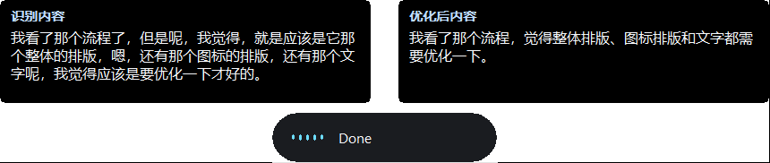
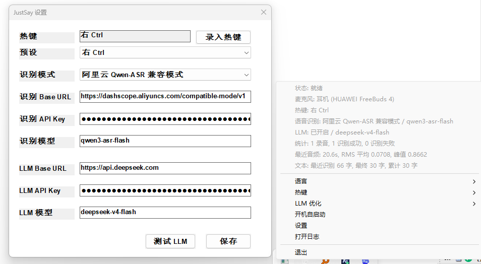

# JustSay

JustSay is a Windows 10/11 system tray press-to-talk voice input app written in Rust.

Hold a global hotkey to record. Release the hotkey to transcribe speech, optionally refine the transcript with an LLM, and paste the final text into the currently focused input field.

[中文说明](README.zh.md)

## Screenshots





## Features

- System tray app with no normal taskbar window.
- Press-to-talk global hotkeys with presets and custom recording: Right Ctrl, CapsLock, Right Alt, Ctrl+Space, F13, Pause, and modifier combinations.
- Fn is not used as the default hotkey because Windows usually cannot reliably capture Fn keys.
- Microphone capture via `cpal`, converted to 16 kHz mono WAV for STT backends.
- Default recognition language: Simplified Chinese (`zh-CN`).
- Language choices: English, Simplified Chinese, Traditional Chinese, Japanese, Korean.
- STT compatibility modes:
  - OpenAI-style `/audio/transcriptions`
  - Aliyun Qwen-ASR `/chat/completions`
- Optional LLM refinement for cleaning up speech transcripts. The first pass returns a confidence score; scores below 85 trigger a second intent-aware correction pass before paste.
- Optional Voice Actions intent routing. When enabled, clear commands such as web search, open URL, open JustSay settings/logs, or opening a local app can run as actions instead of being pasted as text.
- Non-activating always-on-top overlay with RMS-driven waveform and optional before/after debug panels.
- Clipboard-preserving text injection using Win32 Clipboard API and `SendInput`.
- Best-effort IME/layout handling before paste.
- Local config under AppData, API keys encrypted with Windows DPAPI.
- Logs under LocalAppData and an `Open Logs` tray menu item.
- Optional start-at-login through the current-user Registry Run key.

## Configuration

Open the tray menu and choose `Settings`.

For OpenAI-compatible STT:

```text
STT Mode: OpenAI /audio/transcriptions
STT Base URL: https://api.openai.com/v1
STT Model: whisper-1
```

For Aliyun Qwen-ASR:

```text
STT Mode: Aliyun Qwen-ASR /chat/completions
STT Base URL: https://dashscope.aliyuncs.com/compatible-mode/v1
STT Model: qwen3-asr-flash
```

LLM refinement uses an OpenAI-compatible Chat Completions endpoint. Use a chat model, not an ASR model. The refiner asks the model to return JSON with corrected text, a confidence score, and a short reason. If the first score is below 85, JustSay runs a second pass that re-evaluates likely speech recognition errors from the original STT text and first-pass result.

```text
LLM Base URL: https://dashscope.aliyuncs.com/compatible-mode/v1
LLM Model: a chat model available in your account
```

Voice Actions is disabled by default. It reuses the LLM Chat Completions settings for conservative intent classification. If the intent is unclear, the app falls back to the normal refine-and-paste flow.

Configuration is stored in:

```text
%APPDATA%\JustSay\config.toml
```

API keys are encrypted with Windows DPAPI before being written to the local config file.

## Logs

Logs are written to:

```text
%LOCALAPPDATA%\JustSay\logs
```

Use the tray menu item `Open Logs` to open the latest log file.

When LLM refinement or Voice Actions are enabled, logs can include dictated text, LLM before/after text, refinement scores, intent JSON, and action results for debugging. Do not share logs publicly if they contain private dictated content.

## Build

Install the Windows MSVC Rust target:

```powershell
rustup target add x86_64-pc-windows-msvc
```

Build with the helper script:

```powershell
.\scripts\build.ps1 build
```

Or build directly with Cargo:

```powershell
cargo build --release --target x86_64-pc-windows-msvc
```

The executable is written to:

```text
target\x86_64-pc-windows-msvc\release\justsay.exe
```

## Release Workflow

GitHub Actions release builds are tag-only. Push a tag to build and publish `justsay.exe` directly as a GitHub Release asset:

```powershell
git tag v0.1.0
git push origin v0.1.0
```

The workflow builds on `windows-latest`, compresses the executable with UPX, and uploads the `.exe` itself without wrapping it in a zip.

## Security Notes

JustSay uses a global low-level keyboard hook, clipboard access, and simulated paste. These are expected for this kind of app, but security software may flag unsigned builds. Production distribution should use code signing and clear documentation.

JustSay does not require administrator privileges.
